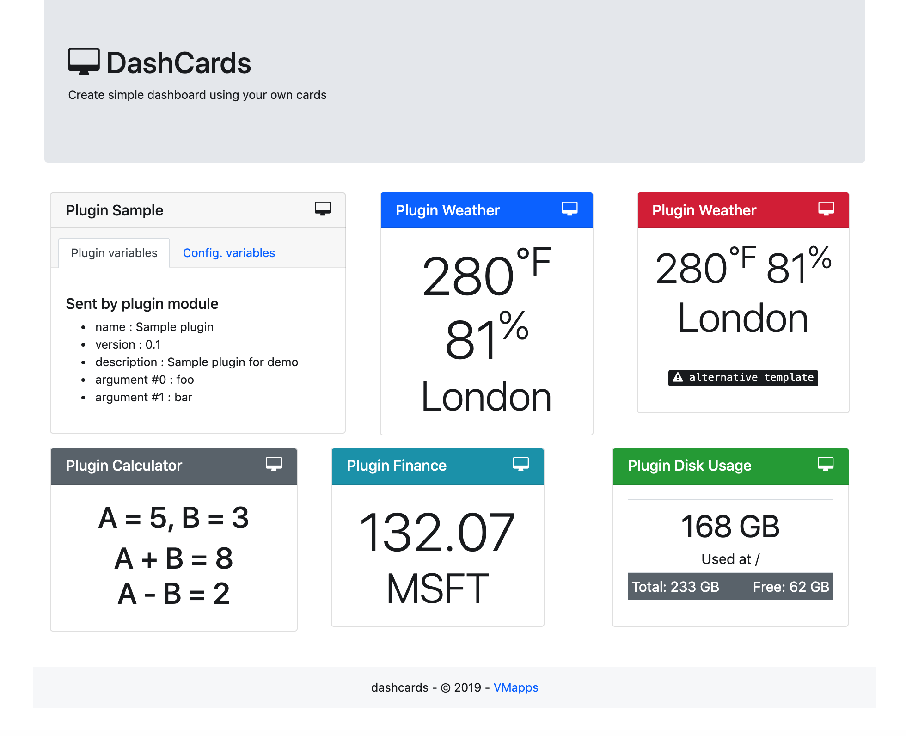

# dashcards
Build HTML dashboard using user-defined cards (bootstrap4 support)

## Purpose 
Purpose of this very simple tool is to :
- build a HTML dashboard using cards 
- cards are kind of plugins that user can develop
- cards can be called multiple times
This small project has been first been developed to build a dashboard 
to Raspberry PI devices, to run it through crontab and to share the
HTML page using a standard web server.

## Requirements
Following python modules are required :
- [jinja2](http://jinja.pocoo.org/)

Modules could be installed using following commands:
```
$ pip install -r requirements.txt
```
## Configuration
Settings have to be changed using file **config-template.json** :
```
# enable/disable debug mode
"debug": [true|false]

# cards (array of settings)
{
	"title": "<name of the card>",
	"plugin": "<plugin to be used>",
	"arguments": [<arguments>,<sent>,<to>,<plugin>]
}
```
Then rename template file as config.json
```
mv config-template.json config.json
```
## Usage
```
usage: dashcards.py [-h] [-d] [-c <filename>] [-t <filename>] [-o <filename>]

optional arguments:
  -h, --help     show this help message and exit
  -d, --debug    force debug mode (not used yet)
  -c <filename>  config file name (defaut: config.json)
  -t <filename>  templates directory name (defaut: templates)
  -o <filename>  output file name
```
## Plugins 
#### Structure
Plugins should respect following rules:
- been placed into 'plugins' directory
- plugin code could be named `<plugin>.py`
- plugin card could be named `<plugin>.html`
- have declared (at least) variables named : `name`, `version`, `url`, `author`, `contact`, `description`
- have declared (at least) functions named : `test()`, `run()`

#### Functions
Two functions are required for each plugin:
- `test()` : could be executed in debug mode 
- `run()` : main plugin function called by main program
- plugin should return a JSON object after execution of `run()`
- JSON object is then rendered with Jinja2 using plugin HTML template

#### Rendering
Jinja2 templating module is used to render HTML :
- JSON object returned by plugin is sent to template as variables `render.xxx`
- card config is available in templates as variables `card.xx` + `card.id` (random)

## Sample plugin
#### Python code
```
#!/usr/bin/env python3

import json

name = 'Sample plugin'
version = '0.1'
url = 'https://githib.com/vmapps/'
author = 'VMapps'
contact	= '31423375+vmapps@users.noreply.github.com'
description = 'Sample plugin for demo'

def test():
	return name + ' - v' + version

def run(args):
	return { 'name':name, 
			'version':version, 
			'description':description, 
			'arg0':args[0], 
			'arg1':args[1] 
			}
```

#### HTML template
```
<div class="card {{ card.plugin }}" id="{{ card.id }}">
	<h5 class="card-header">{{ card.title }}</h5>
	<div class="card-body">Plugin items:
		<li>name : {{ render.name }}</li>
		<li>version : {{ render.version }}</li>
		<li>description : {{ render.description }}</li>
		<li>argument #0 : {{ render.arg0 }}</li>
		<li>argument #1 : {{ render.arg1 }}</li>
	</div>
	<div class="card-footer">Card config:
		<li>id: {{ card.id }}</li>
		<li>title: {{ card.title }}</li>
		<li>plugin: {{ card.plugin }}</li>
		<li>arguments: {{ card.arguments }}</li>
		<li>dummy: {{ card.dummy }}</li>
	</div>
</div>
```

#### Card configuration
```
{
	"title": "Test Sample",
	"plugin": "sample",
	"arguments": ["foo","bar"],
	"dummy": "foo/bar"
}
```

#### HTML Output
```
<div class="card sample" id="65f053e29a6043a09fd2b98993d8d91b">
        <h5 class="card-header">Test Sample</h5>
        <div class="card-body">Plugin items:
                <li>name : Sample plugin</li>
                <li>version : 0.1</li>
                <li>description : Sample plugin for demo</li>
                <li>argument #0 : foo</li>
                <li>argument #1 : bar</li>
        </div>
        <div class="card-footer">Card config:
                <li>id: 65f053e29a6043a09fd2b98993d8d91b</li>
                <li>title: Test Sample</li>
                <li>plugin: sample</li>
                <li>arguments: ['foo', 'bar']</li>
                <li>dummy: foo/bar</li>
        </div>
</div>
```
## Plugins 
